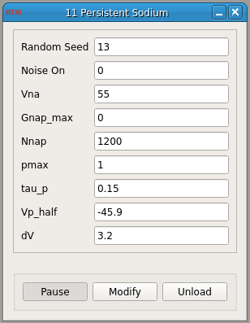

###Persistent Na Conductance

**Requirements:** None  
**Limitations:** None  

  

<!--start-->

This module creates a persistent sodium conductance with the option of adding stochastic or deterministic noise.  

<!--end-->

####Input Channels
1. input(0) - Vm : membrane voltage  (mV)

####Output Channels
1. output(0) - Iapp : injected current (pA)

####Parameters
1. Random Seed - seed for random number generator
2. Noise On - 1 for stochastic channel, 0 for deterministic
3. Vna - sodium reversal potential (mV)
4. Gnap_max - maximum channel conductance (ns)
5. Nnap - number of persistent Na channels
6. pmax - maximum fraction of open channels
7. tau_p - persistent Na channel time constant
8. Vp_half - PNa half activation voltage (mV)
9. dV - related to slope of activation curve (mV)
